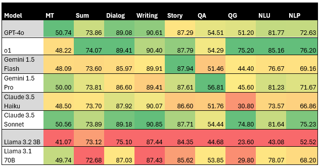

# LLM_NLP_Evaluation
## A Comparison of the Linguistic Abilities of Large Language Models: Analysis and Evaluation

### Abstract

This thesis analyzes and compares the linguistic capabilities of the most prominent Large Language Models (LLMs) currently available. The focus lies on "General-Purpose" models such as GPT-4o, Claude-3.5, and Gemini, which are versatile and widely used. The study aims to evaluate these models in areas like natural language understanding, machine translation, summarization, and dialog generation. Modern metrics, including LLM-as-a-Judge approaches, are employed to better simulate human judgment. The research also investigates the impact of model architectures and training data on performance. Results reveal significant differences in linguistic processing abilities, particularly in natural language understanding and question generation. Based on the results, strengths and weaknesses are identified for each tested model. This thesis not only provides a snapshot of current performance but also offers a scalable methodology for future comparisons. It thereby lays the foundation for more effective and responsible use of LLMs in practical applications.

### Purpose

This repository hosts the code and the data used for evaluating the linguistic abilities of Large Language Models. Additionally, the repository contains the experiment's results in numerical form and as illustrative graphs in JSON and xlsx files.

### Structure of the Repository

The repository contains the complete code to reproduce the experiment evaluating the language capabilities of large language models.

* In the CondaEnv folder, you will find the backup of the Conda environment prepared for this code.
* In the Benchmarks folder, there are scripts that use several metrics and datasets to calculate the results for an entire task area, such as summarization.
* In the Metrics folder, you will find the scripts for the individual metrics used.
* In the Models folder, there is the script for integrating the used models.
* In the dataload folder, you will find the scripts for integrating the used datasets.
* In the main script, you can select the models as well as the desired benchmarks/metrics. Running the main method starts the script.
* The Utils script contains helper methods.

Apart from the code, the data folder contains datasets that were not available via the Huggingface API and were integrated manually. In the Predictions_Results_Errors folder, you will find the results of the two experiment runs along with the model predictions, error logs, and processed tables and visualizations.

### Models, Test Areas, and Metrics Used

#### Models
In the experiment, the following models were tested for their language capabilities:

* GPT-4o (OpenAI)
* o1 (OpenAI)
* Gemini 1.5 Flash (Google)
* Gemini 1.5 Pro (Google)
* Claude 3.5 Haiku (Anthropic)
* Claude 3.5 Sonnet (Anthrophic)
* LLama 3.2 3B (Meta)
* LLama 3.1 70B (Meta)

#### Test Areas, Metrics & Benchmarks
The models were evaluated in the following areas of Natural Language Processing with the following Metrics and Benchmarks:

* Natural Language Understanding: SuperGLUE-Benchmark
* Machine Translation: BLEU, METEOR, BLEURT
* Summarization: ROUGE, MoverScore, LLM-as-a-Judge
* Dialog: LLM-as-a-Judge
* Writing: LLM-as-a-Judge
* Story: LLM-as-a-Judge
* Question Answering: Accuracy, F1-Score
* Question Generation: Accuracy-based QG-Metric

### Overall Results
The following diagram shows the overall results of the experiment. More detailed results can be found in the Results folder.
It is important to note that results from different test areas are not directly comparable due to the different metrics used.

MT: Machine Translation; Sum: Summarization; Story: Story Generation; QA: Question Answering; QG: Question Generation; NLU: Natural Language Understanding; NLP: Natural Language Processing ( Overall Score)

### How to use

To use the code and reproduce the experiment, the following steps are necessary:

1.  Set up the Conda environment from CondaEnv.
2.  Configure API keys in models.py for the different model types. With the current model selection, an OpenAI API key, a Google API key, an Anthropic API key, and a HuggingFace API key are required.
3.  Select the desired models and test areas in the main script.

To extend the experiment, all models available through the respective APIs from OpenAI, Google, and Anthropic can be integrated into the main method using the existing methods. Additionally, many more models can be incorporated via the HuggingFace API. Furthermore, the models script can be expanded with additional model integrations.

In the dataload scripts, additional datasets can be added easily by creating them as a class in dataset.py and then incorporating them into dataload.py.

New metrics and benchmarks can be added as separate Python scripts in the Benchmarks and Metrics folders.

